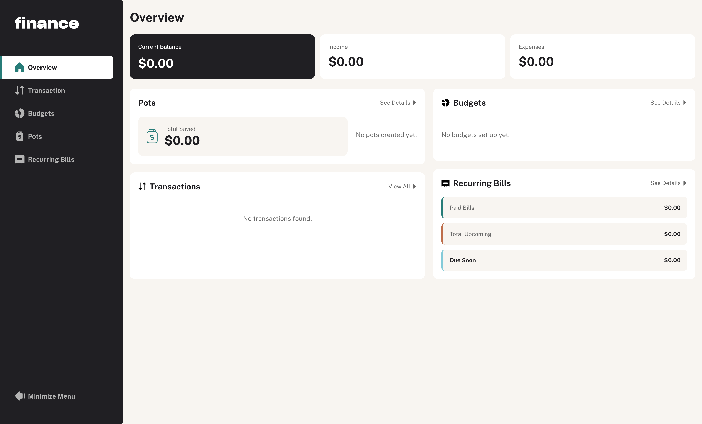

# Finance - Personal Budget Management App



A modern, full-featured personal finance and budget management application built with Ruby on Rails 8. Track your income, expenses, set budgets, manage savings goals, and monitor recurring bills - all in one place.

## Features

### 💰 Financial Overview

- **Dashboard**: Comprehensive financial overview with current balance, monthly income/expenses
- **Transaction Tracking**: Record and categorize all income and expenses
- **Visual Analytics**: Charts and graphs for spending patterns and budget progress

### 🎯 Budget Management

- **Category-based Budgets**: Set spending limits for different expense categories
- **Budget Progress Tracking**: Visual indicators showing spent vs. budgeted amounts
- **Spending Alerts**: Monitor budget utilization with color-coded progress bars

### 🏦 Savings Goals

- **Savings Pots**: Create and track multiple savings goals
- **Progress Visualization**: See how close you are to reaching your savings targets
- **Flexible Contributions**: Add money to pots through deposits

### 📅 Recurring Bills

- **Bill Tracking**: Monitor upcoming and past-due recurring expenses
- **Due Date Alerts**: Get notified about bills coming due soon
- **Payment History**: Track when bills were paid

### 🔐 Security & User Experience

- **Secure Authentication**: Password-based login with session management
- **Responsive Design**: Works seamlessly on desktop and mobile devices
- **Modern UI**: Clean, intuitive interface built with Tailwind CSS
- **Progressive Web App**: Installable on mobile devices for offline access
- **Real-time Updates**: Hotwire-powered dynamic updates without page refreshes

## Technology Stack

### Backend

- **Ruby**: 3.4.2
- **Rails**: 8.0.2
- **Database**: SQLite 3 (with Solid Queue, Solid Cache, Solid Cable)
- **Authentication**: Custom session-based auth with `bcrypt` password hashing

### Frontend

- **Hotwire**: Turbo + Stimulus for modern, reactive web applications
- **Tailwind CSS**: Utility-first CSS framework for responsive design
- **Import Maps**: Modern ES modules without build tools
- **Chartkick**: Simple Ruby gem for creating charts

### Infrastructure

- **Docker**: Containerized deployment
- **Kamal**: Zero-downtime deployments
- **Solid Suite**: Modern Rails background job processing, caching, and websockets
- **Puma**: High-performance web server
- **Thruster**: HTTP asset caching and compression

### Development Tools

- **Testing**: System tests with Capybara + Selenium
- **Code Quality**: RuboCop, Standard Ruby linting
- **Security**: Brakeman vulnerability scanner
- **Debugging**: Ruby LSP, Web Console

## Prerequisites

Before running this application, make sure you have the following installed:

- **Ruby**: 3.4.2 (use a Ruby version manager like `rbenv`, `asdf`, or `mise`)
- **SQLite3**: Database for development and testing
- **Node.js**: For JavaScript dependencies (comes with import maps)
- **Docker**: For containerized deployment (optional)

## Quick Start

1. **Clone the repository**

   ```bash
   git clone <repository-url>
   cd finance-rails
   ```

2. **Install dependencies**

   ```bash
   bundle install
   ```

3. **Setup the database**

   ```bash
   bin/rails db:setup
   ```

4. **Start the development server**

   ```bash
   bin/dev
   ```

5. **Open your browser**
   Visit `http://localhost:3000` and create your account!

## Development Workflow

### Available Scripts

- `bin/dev` - Start development server with CSS watching
- `bin/rails server` - Start Rails server only
- `bin/rails tailwindcss:watch` - Watch and compile Tailwind CSS
- `bin/rails test` - Run test suite
- `bin/rails test:system` - Run system tests only
- `bin/rubocop` - Check code style
- `bin/brakeman` - Security vulnerability scan

### Code Quality

This project uses several tools to maintain code quality:

```bash
# Run all quality checks
bundle exec standardrb
bundle exec rubocop
bundle exec brakeman

# Auto-fix style issues
bundle exec standardrb --fix
bundle exec rubocop --autocorrect
```

## Database Schema

The application uses the following main data models:

### Core Models

- **Users**: Account information and authentication
- **Transactions**: Income and expense records
- **Categories**: Transaction categorization
- **Budgets**: Spending limits by category
- **Pots**: Savings goals and tracking
- **Sessions**: User authentication sessions

### Key Relationships

- Users have many transactions, budgets, pots, and categories
- Transactions belong to users and optionally to categories
- Budgets belong to users and optionally to categories
- Pots belong to users

## API Endpoints

### Authentication

- `GET /` - Dashboard overview (requires auth)
- `GET /new` - New session (login)
- `POST /session` - Create session
- `DELETE /session` - Destroy session

### Resources

- `GET /transactions` - List transactions
- `GET /budgets` - List budgets
- `GET /pots` - List savings pots
- `GET /bills` - List recurring bills
- `GET /categories` - List categories

## Testing

The application includes comprehensive test coverage:

```bash
# Run all tests
bin/rails test

# Run system tests (end-to-end)
bin/rails test:system

# Run specific test file
bin/rails test test/controllers/dashboard_controller_test.rb
```

## Deployment

### Docker Deployment

1. **Build the Docker image**

   ```bash
   docker build -t finance .
   ```

2. **Run the container**

   ```bash
   docker run -d -p 80:80 -e RAILS_MASTER_KEY=<your-key> --name finance finance
   ```

### Kamal Deployment

1. **Configure deployment** (edit `config/deploy.yml`)

   ```bash
   # Update server IPs, domain, and registry credentials
   ```

2. **Deploy**

   ```bash
   kamal setup    # First time setup
   kamal deploy   # Subsequent deployments
   ```

## Environment Variables

Create a `.env` file or set these environment variables:

- `RAILS_MASTER_KEY` - Required for production (found in `config/master.key`)
- `RAILS_ENV` - Environment (development/test/production)
- `DATABASE_URL` - Database connection string (optional, defaults to SQLite)

## Project Structure

```text
app/
├── assets/          # Static assets (CSS, images, fonts)
├── channels/        # Action Cable channels
├── components/      # View components
├── controllers/     # Rails controllers
├── helpers/         # View helpers
├── jobs/            # Background jobs
├── mailers/         # Email delivery
├── models/          # Data models
├── views/           # ERB templates
└── javascript/      # Stimulus controllers

config/              # Rails configuration
db/                  # Database schema and migrations
lib/                 # Custom libraries
test/                # Test suite
```

```bash
# Additional files in root:
bin/                 # Executable scripts
config.ru           # Rack configuration
Dockerfile          # Docker image definition
Gemfile             # Ruby dependencies
Procfile.dev        # Development process configuration
```

## Contributing

1. Fork the repository
2. Create a feature branch (`git checkout -b feature/amazing-feature`)
3. Commit your changes (`git commit -m 'Add amazing feature'`)
4. Push to the branch (`git push origin feature/amazing-feature`)
5. Open a Pull Request

### Development Guidelines

- Follow Ruby on Rails conventions
- Write tests for new features
- Use RuboCop and Standard Ruby for code style
- Keep commits focused and descriptive
- Update documentation as needed

## License

This project is open source and available under the [MIT License](LICENSE).

## Support

If you have questions or need help:

1. Check the [Rails Guides](https://guides.rubyonrails.org/) for general Rails questions
2. Review the [Hotwire documentation](https://hotwired.dev/) for frontend concerns
3. Open an issue for bugs or feature requests

---

Built with ❤️ using Ruby on Rails 8
